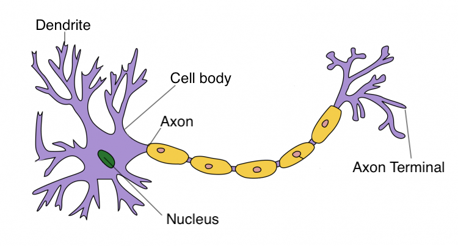
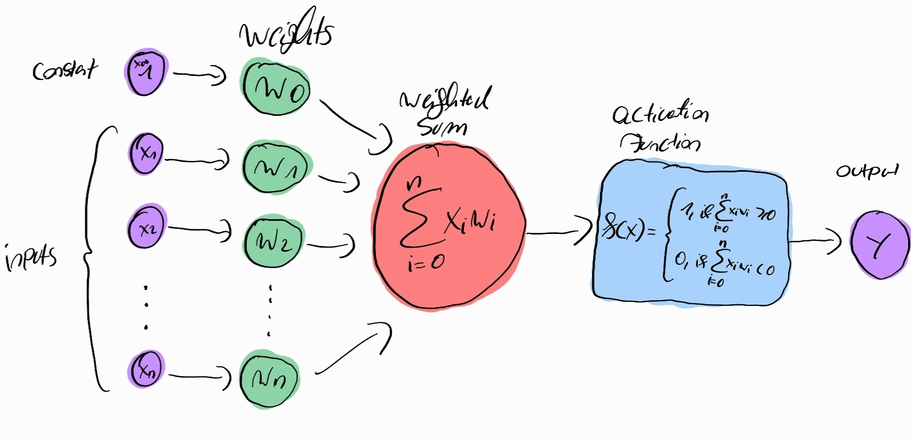
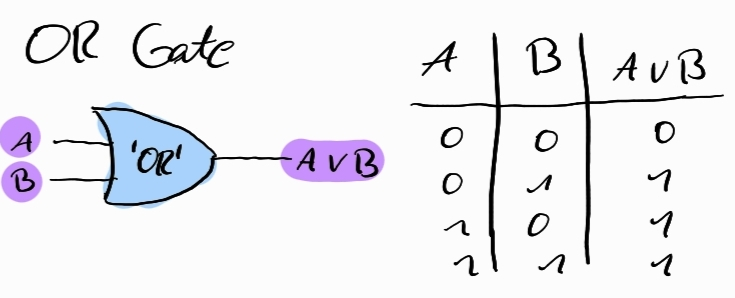
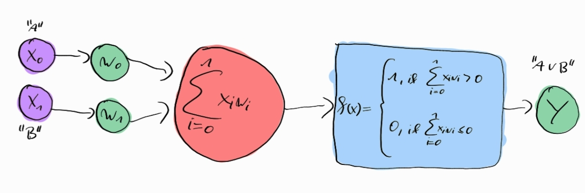
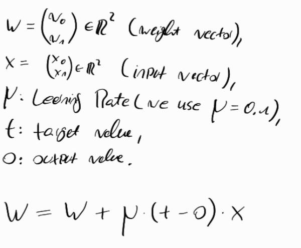
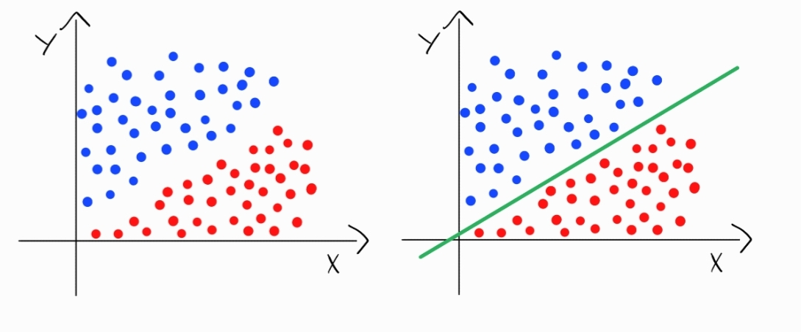
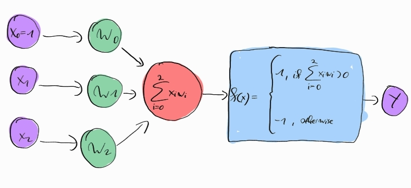

# neural-networks-from-scratch
Learn a little bit about neural networks with raw python.

## Biological neuron

<p float="left">
   
</p>

Neurons are interconnected nerve cells that process and transmits electrochemical signals in the brain.
There are approximately 100 billion of them inside of us, with each neuron connected to about 10,000 other neurons.

## Artifical neuron (Perceptron)

<p float="left">
   
</p>

A perceptron is an artificial neuron. Instead of electrochemical signals, data is represented as numerical values.
These input values, normally labeled as X (See Figure 2), are multiplied by weights (W) and then added to represent the input values’ total strength.
If this weighted sum exceeds the threshold, the perceptron will trigger, sending a signal

You can call a perceptron a single-layer neural network.

## Application

### Logical gates
Our first application of a single layer neural network are logic gates.

#### OR Gate

<p float="left">
   
</p>

<p float="left">
   
</p>


#### Implementation in Python

```python
import numpy as np

class Perceptron:
    """
    A simple single-layer neuronal network (perceptron) of the OR Gate. 
    """
    def __init__(self):
        self.w = np.zeros(2)
        self.learning_rate = 0.1
        self.threshold = 0

    def __call__(self, x: np.array):
        if np.dot(x, self.w) > self.threshold:
            return 1
        return 0
    
    def train(self, X: np.array, y: np.array, epochs: int = 1):
        for _ in range(epochs):
            for i, xi in enumerate(X):
                x = xi[:2]
                pred = np.dot(x, self.w)
                if pred != y[i]:
                    self.w = self.w + self.learning_rate * (y[i] - pred) * x
```

With the training data

```python
X = np.array([[0, 0], [0, 1], [1, 0], [1, 1]])
y = np.array([0, 1, 1, 1])
```

<p float="left">
   
</p>

### Linear classifier
Objects are vectors in d dimension. We have exactly two classes (+1, -1). A linear classifier tries to separate the data points by a (d-1)-dimensional hyperplane.

#### Example for d=2: We try to spearate by a single line.

<p float="left">
   
</p>

<p float="left">
   
</p>

```python
import numpy as np

class Perceptron:
    def __init__(self):
        self.w = np.zeros(3)
        self.learning_rate = 0.1
        self.bias = np.array([1.0])

    def train(self, X, y, epochs: int = 100):
        for _ in range(epochs):
            for i, xi in enumerate(X):
                x = np.append(self.bias, xi)
                prediction = np.sign(np.dot(x, self.w))
                if prediction != y[i]:
                    if prediction <= 0:
                        self.w = self.w + self.learning_rate * x
                    else: 
                        self.w = self.w - self.learning_rate * x
```

Create the training data, train it and plot.

```python
from matplotlib import pyplot as plt
# training data 
X = np.array([[1, 1], [1, 3], [3, 1],[1.8, 4.8], [2, 5], [4, 3], [5, 2]])
y = np.array([1, 1, 1, 1, -1, -1, -1])

# seperate blue and red points   
blue_points = X[y == 1] 
red_points = X[y == -1]
    
plt.scatter(blue_points[:, 0], blue_points[:, 1], color='blue', label='Label 1')
plt.scatter(red_points[:, 0], red_points[:, 1], color='red', label='Label -1')
   
plt.xlabel('X1')
plt.ylabel('X2')
plt.legend()
    
# Create single neuron and train it.
neuron = Perceptron()
neuron.train(X, y)

plt.show()
```


